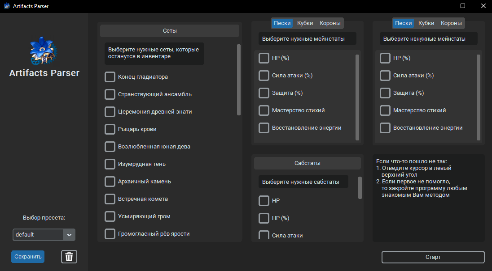
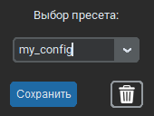

# Genshin Impact Artifact Parser


This Python-based project is designed to help you sort and manage your artifacts in **Genshin Impact**. With this tool, you
can easily organize and categorize your in-game items for better inventory management.

*(only in Russian for now)*

## Table of Contents

- [Features](#features)
- [Installation](#installation)
- [Usage](#usage)
- [Customization](#customization)
- [License](#license)

## Features

- **Item Sorting:** The program allows you to sort your items based on various criteria.
- **Customization:** You can customize the sorting criteria according to your preferences.
- **User-Friendly:** The project provides a user-friendly interface for easy interaction.
- **Presets:** Create and use your own presets to save time.

## Installation
from source

1. Clone the repository to your local machine:

   ```shell
   git clone https://github.com/Trum-ok/genshin-art-parser.git

2. Navigate to the project directory:

   ```shell
   cd genshin-art-parser

3. Install the required dependencies using pip:

    ```shell
    pip install -r requirements.txt
    ```
4. Install tesseract

## Usage

   ```shell
   python3 app.py
   ```



Enjoy your organized inventory!

## Customization

### Custom presets
Select the desired parameters,  
Enter the desired name  _e.g. my_config_  (without /, :, *, ?, ", <, >, |, +, ,\)  
Press save button  
  


### Advanced customisation

After the first run, the presets folder and 3 files inside will appear in the application directory. 
```shell
| Art.exe
| presets
    | config.json
    | default.json
    | nothing.json
| logs
    | art_parser.log
    | summary.txt
| tesseract
    | tesseract.exe
    | tessdata
        | rus.traineddata
```

### config.json
```json
{
  "presets": ["nothing", "default"],
  "path_to_tesseract": "tesseract",
  "language": "rus",
  "app_theme": "dark",
  "auto_open_genshin": "True",
  "screen_ratio": "16:9"
}
```
+ **app_theme:** dark / light / system
+ **auto_open_genshin:** True / False _(only False right now)_
+ **screen_ratio:** 16:9 / 16:10 / 4:3 _(only 16:9 right now)_

### default.json
This preset is loaded by default. It is most convenient to edit in the application itself. 
(Select the default preset, create the required configuration, save)
```json
{
  "sets": [],
  "sands": [],
  "goblet": [],
  "circlet": [
    "Шанс крит. попадания",
    "Крит. урон"
  ],
  "sands_d": [],
  "goblet_d": [],
  "circlet_d": [],
  "substats": [
    "Шанс крит. попадания",
    "Крит. урон"
  ]
}
```


## License

This project is licensed under the _MIT License_.
